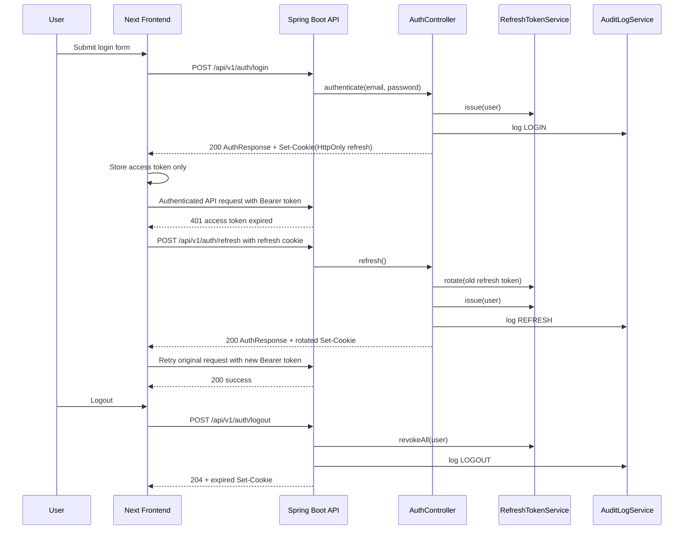
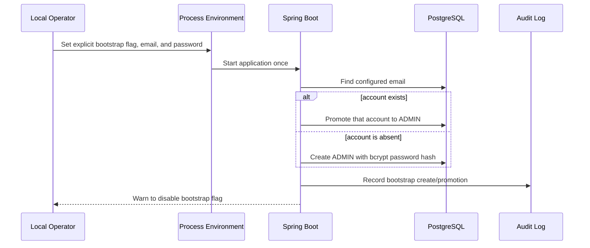

# Auth Session Sequence

## Purpose

Describe the access-token plus refresh-cookie flow used by the frontend and Spring Boot backend after the P0 security hardening work.

## Sequence Diagram

## Notes

- The refresh cookie is the preferred production path.
- The refresh body field remains documented only for compatibility with older clients.
- Session failure clears client-side access state and redirects the user to `/login`.

## Initial Administrator Bootstrap

There is intentionally no public Admin registration request. See `docs/operations/BOOTSTRAP_ADMIN.md` for the local procedure.
