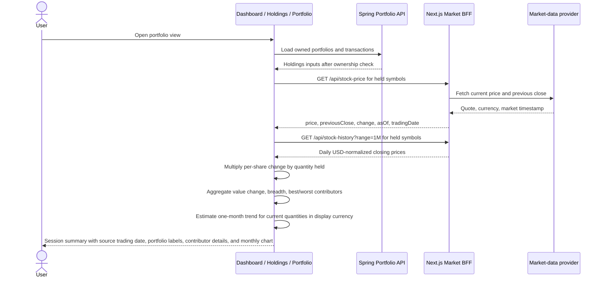

# Daily Session Summary Sequence

The Dashboard, aggregate Holdings page, and individual portfolio page show how
the user's current holdings changed in the latest market session. This is
portfolio analytics, not trading or financial advice.

## Calculation

- Position change = `quantity * (currentPrice - previousClose)`.
- Portfolio percentage = `sum(position change) / sum(quantity * previousClose)`.
- Currency conversion uses the same FX path as the surrounding page.
- The displayed date uses the provider's latest trading-session date
  (tradingDate, formatted as day/month/year), not the browser or server date.
- Cash positions do not provide a trading date and therefore cannot move the
  summary date forward on weekends or market holidays.
- A missing or invalid previous close is never replaced with cost basis. The
  position is excluded and the unavailable count is shown.
- The one-month chart backcasts the currently held quantities through market
  closes. It is labeled as an estimate and does not claim cash-flow-adjusted
  portfolio performance.
- Reading the summary creates no mutation. Moving a symbol is a separate,
  explicit user action described in `POSITION_TRANSFER_SEQUENCE.md`.
