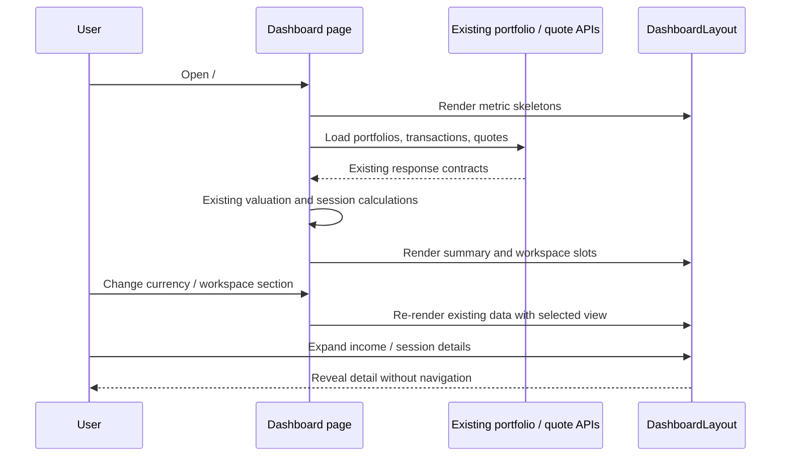

# Dashboard layout

The dashboard route remains `/`. This is a presentation-only update:
no API contract, OpenAPI operation, database schema, valuation formula,
or financial mutation changes.

## Reading order

1. Page title and display currency
2. Four compact key metrics, with skeletons while loading. Income and daily
   movement details open in a full-width row below the metrics, one at a time.
3. Holdings, watchlists, goals, news, and transaction history share the tabbed
   management workspace. Each priced holding includes a compact sparkline for
   its five latest trading sessions, using the existing one-month
   price-history response.
4. Latest session summary in the right pane. Per-symbol details include the
   previous close, current price, session high, and session low.
5. Performance and allocation in the right pane. The asset trend uses the
   available one-month daily market history and shows an explicit unavailable
   state instead of drawing a misleading transaction-price estimate.
6. Volatility alerts below the analytics area

At 900px and above, the page uses two independent vertical scroll panes. The
wider left pane owns the title, key metrics, and management workspace. The
right pane owns session analysis, charts, activity, and alerts. Each pane is
viewport-height and has its own scrollbar. Tables use horizontal overflow but
do not introduce a nested vertical scrollbar. Only the symbol column stays
pinned on narrow screens.

## Responsive behavior

Breakpoints use the available dashboard container width after the sidebar:
below 480px metrics stack; from 480px they use two columns; from 900px
they use two columns. At 900px the two main panes activate; analytics and
activity stack inside the right pane so their charts retain enough width.
Below that breakpoint both panes return to one document scrollbar. Existing
theme tokens are retained.

## Sequence

## Verification

Component tests cover reading order, loading placeholders, the five-session
price sparkline, optional panels, currency switching, transaction-history
placement in the workspace tabs, income and daily-mover expansion, and
empty-state portfolio creation. Visual QA should
include 375px, 768px, 1440px, long portfolio names, USD/VND, and the user's
active theme.
