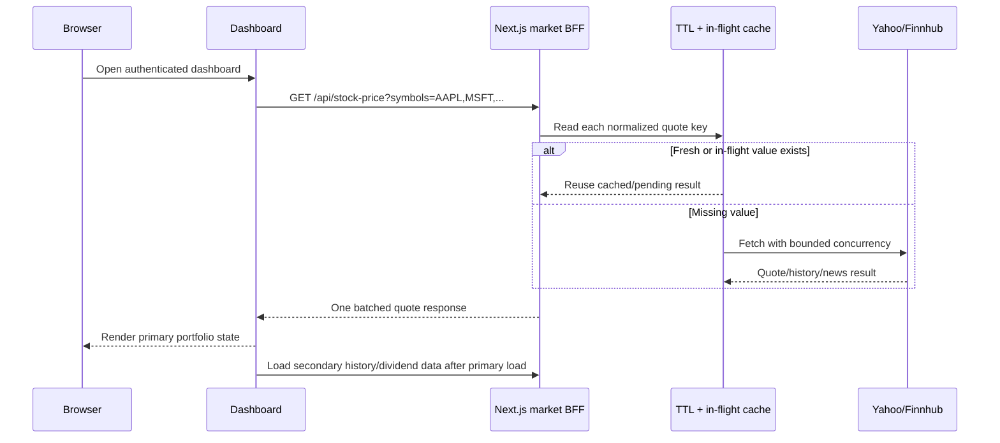

# Data Loading Performance

## Scope

This optimization covers the web dashboard and the internal Next.js market-data
routes. It does not change the public Spring Boot API contract or the database
schema.

## Observed bottlenecks

| Area | Previous behavior | Impact |
|------|-------------------|--------|
| Authentication routes | Sidebar, canvas effects, and AI chat rendered on login/register | Unnecessary client code and UI work before authentication |
| Dashboard quotes | One browser request per held symbol | N-request fan-out on every dashboard load |
| Market providers | Identical concurrent requests were not coalesced | Duplicate Yahoo/Finnhub traffic during multi-panel renders |
| Symbol resolution | History route probed every exchange candidate after finding a valid one | Extra provider latency and traffic |
| News | Headline-only mover cards requested full article crawling | Up to five page crawls per symbol for content not displayed |
| React Query | Refetched stale screens whenever the window regained focus | Request bursts after tab switching |

## Optimized sequence

## Cache policy

| Data | Server TTL | Browser/CDN policy |
|------|------------|--------------------|
| Live quote | 20 seconds | 15-second browser cache, 20-second shared cache |
| FX conversion | 15 minutes | Reused inside quote requests |
| Price history | 15 minutes | 5-minute browser cache, 15-minute shared cache |
| Max-range history | 6 hours | Same response policy; longer server reuse |
| Fundamentals | 6 hours | Returned with history |
| Dividends | 6 hours | 30-minute browser cache, 6-hour shared cache |
| News | 5 minutes | 5-minute browser cache, 15-minute shared cache |

Provider failures are not stored by the generic cache. Route-level fallback
payloads may be briefly reused to prevent repeated provider hammering.

## Verification

- Unit tests cover TTL expiry, in-flight request coalescing, rejected loaders,
  result ordering, and concurrency limits.
- Browser verification checks that authentication routes no longer render the
  authenticated sidebar, canvas effects, or AI chat.
- Type checking and the full frontend test suite remain required before release.

## Database update

None. This change adds no tables, columns, indexes, or migrations.
