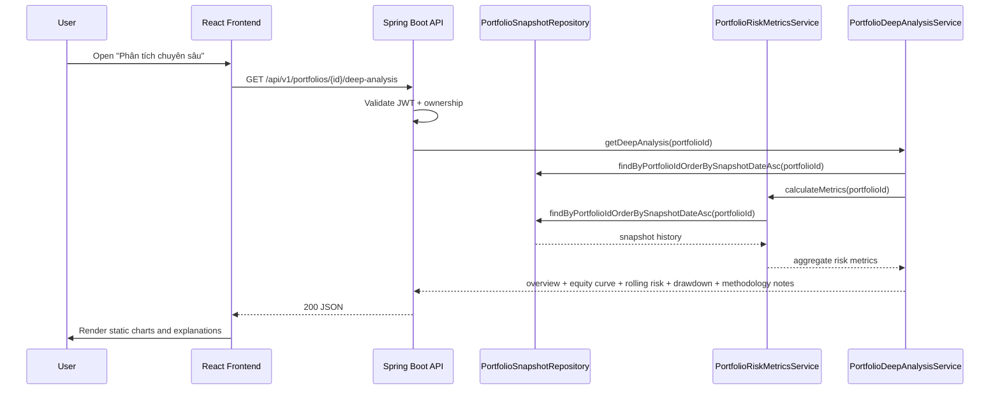

# Deep Analysis Sequence

## Purpose

Trang `Phân tích chuyên sâu` gom dữ liệu snapshot và risk metrics vào một luồng duy nhất để giảm số lần gọi, tăng tốc tải trang, và giữ cách diễn giải nhất quán giữa frontend và backend.

## Sequence Diagram

## Notes

- Nguồn dữ liệu là `portfolio_snapshots` nội bộ.
- Không thêm AI claim mới ở backend; frontend chỉ diễn giải từ dữ liệu tính toán nội bộ.
- Payload có trường methodology để nêu nguồn, cách tính, và mức bất định.
