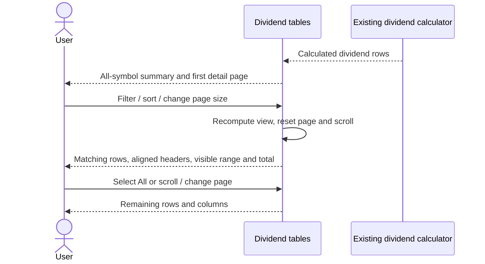

# Dividend table visibility

This is a presentation-only fix for the Ledger dividend tab. Dividend calculation,
currency conversion, API contracts/OpenAPI, persistence, and audit behavior are unchanged.
No database migration or new endpoint is required.

## Layout and interaction

- The ledger owns a viewport-height page scroller; its main content cannot shrink
  below its contents. Bottom padding leaves space for the floating assistant.
- Both tables have a bounded, keyboard-focusable horizontal/vertical scroll region
  with sticky headers. Full values and company names are not truncated.
- The summary retains every calculated symbol and displays its total count.
- Detail rows and headers have nine matching columns. The existing stock-dividend
  recording action is now explicitly labelled and placed last.
- Detail pagination defaults to 25 rows, supports 10/25/50/100 or All, and always
  shows the visible range and filtered total outside the scroll region.
- Filtering, sorting, and changing page size reset to page one. Data refreshes clamp
  an out-of-range page. Page/filter/sort changes reset vertical table scroll.

## Sequence

## Verification

Component tests cover column alignment, all summary rows, complete company names,
pagination and All, filters on later pages, sorting, scroll reset, refreshed data,
empty states, and preserving the existing stock-dividend callback.

Manual browser checks: desktop and narrow viewport; scroll each table to its final
row and rightmost column; confirm sticky headers and footer controls remain usable.
