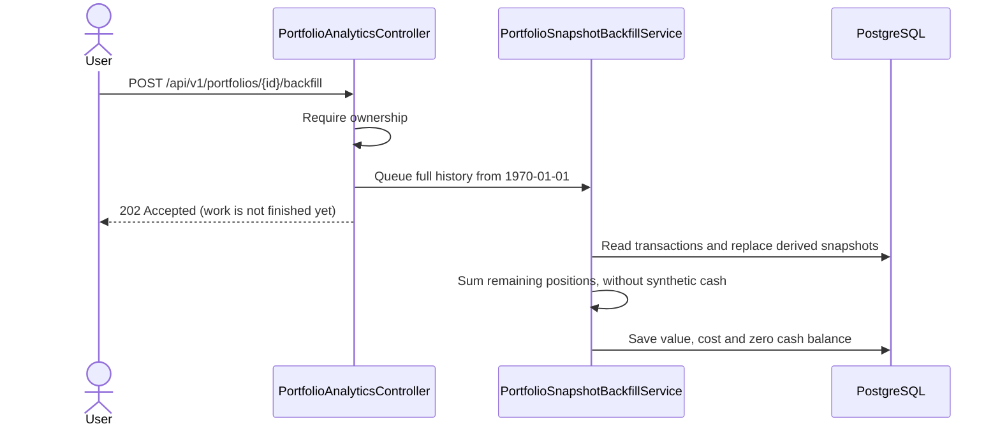

# Holdings-only tracking — 2026-10-02

The owner selected a holdings-only product: record assets bought elsewhere, without requiring deposits or maintaining a cash account.

## Snapshot contract

- `portfolio_value` is the marked value of remaining positions.
- `invested_amount` is their remaining cost basis under the existing backfill cost allocation.
- `cash_balance` is zero. BUY does not create a negative cash account; SELL proceeds are not retained as tracked cash.
- Raw transactions remain unchanged. Existing snapshots need an explicitly authorized rebuild after deploying the new backend.

## Sequence

No schema or request/response fields changed. The explicit backfill endpoint now starts from the full transaction history. The existing daily job remains incremental.

## Regression evidence

The existing snapshot test now expects cost 1005 and marked value 1000 after buying 10 at 100 with fee 5. After selling 2, remaining cost is 804 and value is 960 at a mark of 120. Cash remains zero on both days. Backend suite: 37 passed. Frontend suite after quantity/hydration fixes: 100 passed.

## Limits before acceptance

Backend startup with the new code still needs the correct local PostgreSQL configuration. Existing live snapshots have not been rebuilt. Do not treat the old live server as validation of this change.

Risk metrics based on raw snapshot value changes still require cash-flow-aware review: adding assets is not investment return, and removing assets is not a drawdown. Existing data-provider FX/price fallback and remaining-cost calculations require further acceptance tests. The ZIP is a review build, not a production acceptance certificate.
