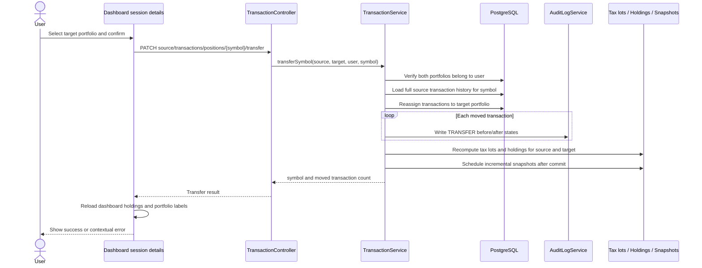

# Position Transfer Sequence

The dashboard can move one symbol to the correct owned portfolio without
creating synthetic trades. The operation reassigns the symbol's complete
transaction history so dates, fees, and cost basis remain intact.

## Safety and data rules

- Source and target must be different portfolios owned by the authenticated user.
- Every transaction mutation writes an audit entry with source and target portfolio IDs.
- The operation is atomic. Any failure rolls back transaction reassignment and audit writes.
- No database migration is required because `transactions.portfolio_id` already represents ownership.
- The operation is portfolio management, not order execution or financial advice.
