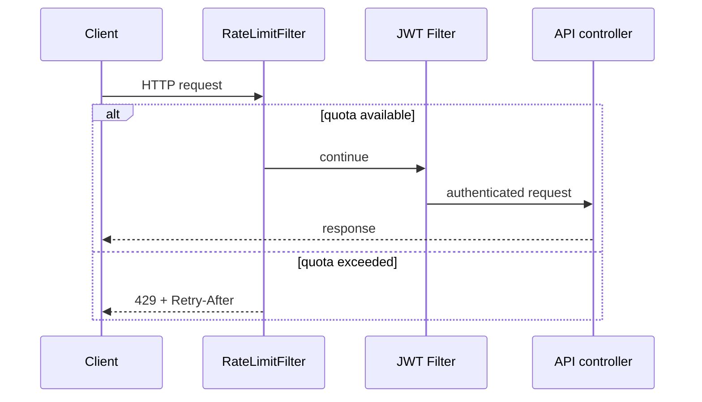

# API Rate Limiting

The backend applies a fixed-window, per-IP limiter before JWT authentication:

| Request group | Default maximum | Window |
|---|---:|---|
| `/api/v1/auth/**` | 10 requests | 1 minute |
| Other API routes | 120 requests | 1 minute |

Configuration keys are `security.rate-limit.auth-per-minute` and
`security.rate-limit.api-per-minute`. Rejected requests return `429 Too Many Requests`, a
`Retry-After` header and no application-side mutation.

This limiter is intentionally local to each application instance. Production deployment must
also enforce a shared limit at the reverse proxy/WAF, particularly when running multiple instances.
