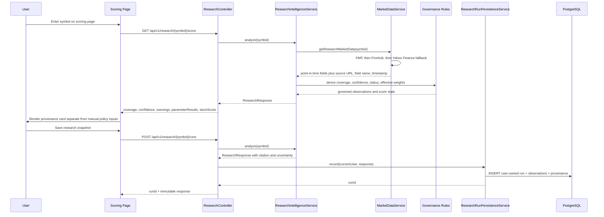

# Research Intelligence Sequence

## Purpose

Document the governed research flow that powers backend research endpoints and the frontend scoring page's source-mapped evidence card.

## Sequence Diagram



## Catalog Import Sequence

```mermaid
sequenceDiagram
    participant A as Admin
    participant API as ResearchCatalogController
    participant IMP as ResearchCatalogImportService
    participant DB as PostgreSQL
    participant AUD as AuditLogService

    A->>API: POST /api/v1/research/catalog/import (DOCX)
    API->>API: Require ADMIN role and non-empty file
    API->>IMP: importDocument(stream, adminId)
    IMP->>IMP: Secure DOCX/XML parse; require all 3,600 codes
    alt malformed, duplicate, or incomplete
        IMP-->>API: 400; no database write
    else valid catalog
        IMP->>DB: Atomic upsert of 3,600 documented definitions
        IMP->>DB: Reapply six approved source-mapped proxy statuses
        IMP->>AUD: Write IMPORT audit record
        IMP-->>API: import summary
        API-->>A: 200; 3,600 rows imported
    end
```

## Notes

- The current implementation activates only six source-mapped proxy parameters: P/E (`M7-001`), P/B (`M7-011`), ROE (`M6-006`), ROIC (`M6-001`), beta (`M10-156`), and dividend yield (`M7-036`).
- The DOCX import fills all 3,600 definitions, but `DOCUMENTED_PENDING_SOURCE_MAPPING` rows remain inactive until a live-source mapping is approved.
- Source name, URL, fields, and retrieval time are returned and persisted. A run selects one provider response, so each active observation can retain exact field-level attribution.
- Research fundamentals use FMP first, Finnhub second, and Yahoo Finance as a no-key fallback for markets such as Korea. The response exposes the selected provider in `dataVersion`; unavailable fields remain missing and do not receive inferred scores.
- Saved runs are user-owned; a user's latest history query cannot retrieve another user's snapshot.
- A null `overallScore` is valid and expected when governance thresholds are not met.
