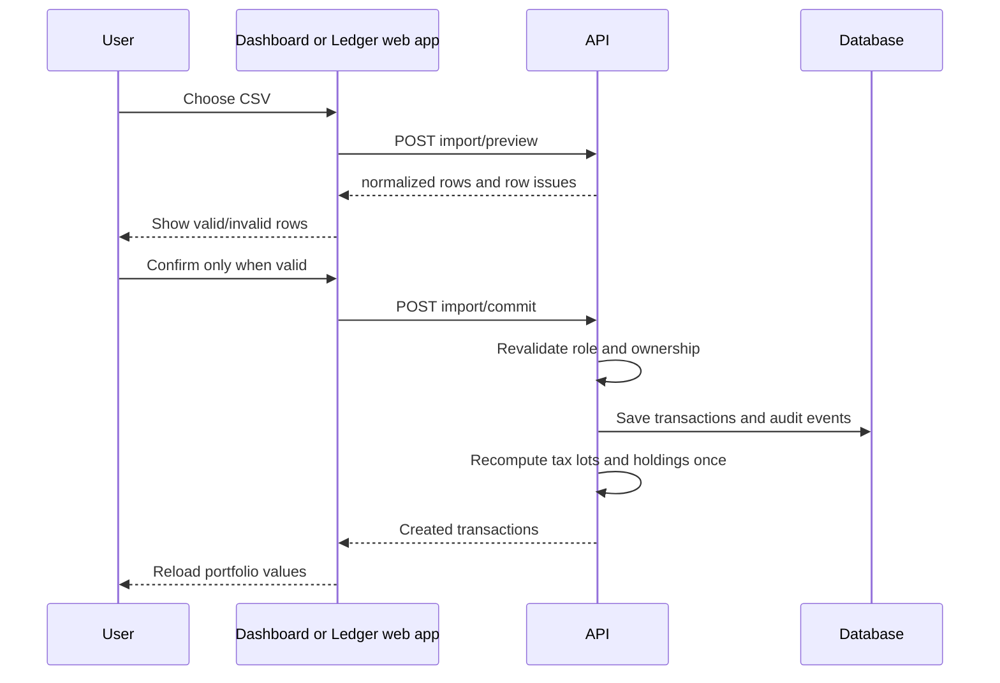

# Transaction CSV Import

## Safety rules

- Only `PREMIUM` and `ADMIN` roles may preview or commit imports.
- A preview validates at most 500 rows and never writes financial data.
- Commit repeats validation; any invalid row rejects the whole batch.
- Ownership of the target portfolio is checked before preview and commit.
- Every committed transaction has an audit event. Tax lots and holdings are recomputed once after the batch is saved.

## Sequence

