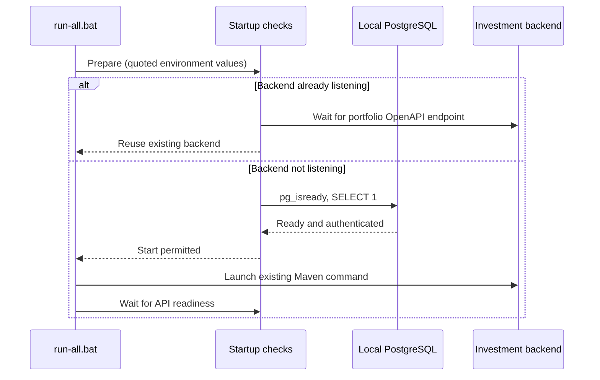

# Local run-all startup

Entry point: `D:\run-all.bat`. A backup of the previous launcher is kept at
`D:\run-all.bat.before-startup-fix.bak`.

The original unquoted `set NAME=value &&` assignments included trailing spaces.
PostgreSQL rejected the resulting username (`postgres `). The corrected launcher
uses quoted assignments and retains the same database and credentials.

The backend block calls `scripts/start-backend-local.ps1` to check PostgreSQL
readiness and run a read-only `SELECT 1` with the actual credentials before Maven.
An existing Investment API is reused. An occupied 8080 port is waited on instead
of starting a duplicate. Readiness is verified using the existing OpenAPI route
and its portfolio endpoint, not merely an open TCP port.

Run `D:\run-all.bat --backend-only` to verify just this backend without relaunching
the seven unrelated applications. Their original launch commands are unchanged.
The launcher does not claim those other applications have passed health checks.

No API contract, OpenAPI definition, schema, migration, database password,
or application business logic was changed. A stopped PostgreSQL Windows service
may require administrator rights to start; errors are reported without retrying
Maven blindly or killing other processes.
